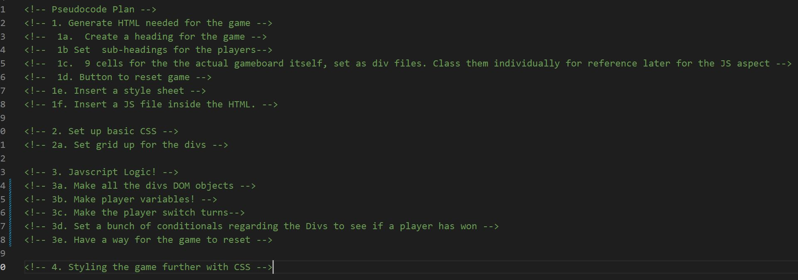

# Hyrule's Tic Tac Toe
Welcome to my version of Tic Tac Toe. I based it around an Intellectual Property that I have loved for over 25 years. This project will be ongoing as my education persists so I can update it to work more efficiently. 

## :computer: [Click here](https://lozlink.github.io/Link-s-TTT/) to see my live project!

## :page_facing_up: About
A simple Zelda-themed Tic-Tac-Toe Game 

## :pencil2: Planning & Problem Solving
- Developed a plan and pseudocode that tried to tackle the project. 

## :rocket: Cool tech
- Javascript!
- HTML!
- CSS!
- Used an unique downloaded font!

## :scream: Bugs to fix :poop:
- Clicking anywhere else on the page still counts it as a click. (fixed on 28/11/2022)
- Can't disable the tiles still working after the game ends.  (fixed on 28/11/2022)

## :sob: Lessons learnt
- Plan Better. 
- Have better time allocation to the prioritized items.
- 

## :white_check_mark: Future features
- Score Counter (Added on 28/11/2022)
- More intuitive feature to reset the game, instead of reloading. (Added on 28/11/2022)
- Audio integration.
